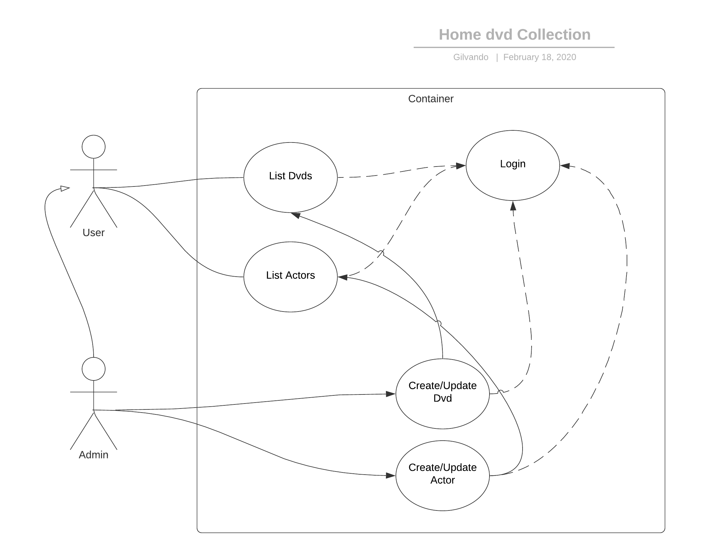

# Home Movie Collection [#5](https://github.com/gilvandovieira/meta/issues/5)

[Em português](LEIAME.md)

This project has/had the objective to train my abilities in python using Django, Djangorestframework, pytest. It is a minimal API, and I'm using the django-admin as a front-end for the input of the data.

This projects has 2 major entities Ator (Actor/Actress) and Filme (Movie)

One **Actor** has a name, CAN be in a movie.
One **Movie** has a name, year and actors in the cast.

## My minimal use case



```python

# Model of Actor

class Ator(models.Model):
    nome = models.CharField(max_length=255, null=False)
    def __str__(self):
        return self.nome #nome = name

```

```python
# Model of Movie
class Filme(models.Model):
    nome = models.CharField(max_length=255, null=False) #Name of movie
    atores = models.ManyToManyField(Ator, related_name='filmes', related_query_name='filme') # Actors in the movie
    ano = models.IntegerField(null=False) #Year

    def __str__(self):
        return '%s (%d)' % (self.nome, self.ano) # Returns "Name of a movie (Year of release)"
```

### Using the [httpie](https://httpie.org/) we have

Do a GET request in the Actors resource should yield not authorized

```json
$ http http://localhost:8000/resources/atores/

HTTP/1.1 403 Forbidden
Allow: GET, POST, HEAD, OPTIONS
Content-Length: 58
Content-Type: application/json
Date: Tue, 18 Feb 2020 21:05:05 GMT
Server: WSGIServer/0.2 CPython/3.8.1
Vary: Accept, Cookie
X-Content-Type-Options: nosniff
X-Frame-Options: DENY

{
    "detail": "Authentication credentials were not provided."
}
```

Passing a valid username and password yields the resource of Actors

```json
$ http -a user:password http://localhost:8000/resources/atores/

HTTP/1.1 200 OK
Allow: GET, POST, HEAD, OPTIONS
Content-Length: 69
Content-Type: application/json
Date: Tue, 18 Feb 2020 21:10:04 GMT
Server: WSGIServer/0.2 CPython/3.8.1
Vary: Accept, Cookie
X-Content-Type-Options: nosniff
X-Frame-Options: DENY

[
    {
        "filmes": [
            1,
            2
        ],
        "id": 1,
        "nome": "L"
    },
    {
        "filmes": [
            2
        ],
        "id": 2,
        "nome": "K"
    }
]

```

The resource of Movies

```json
$ http -a username:password http://localhost:8000/resources/filmes/

HTTP/1.1 200 OK
Allow: GET, POST, HEAD, OPTIONS
Content-Length: 193
Content-Type: application/json
Date: Tue, 18 Feb 2020 21:56:30 GMT
Server: WSGIServer/0.2 CPython/3.8.1
Vary: Accept, Cookie
X-Content-Type-Options: nosniff
X-Frame-Options: DENY

[
    {
        "ano": 2001,
        "atores": [
            1
        ],
        "id": 1,
        "nome": "G"
    },
    {
        "ano": 2002,
        "atores": [
            2
        ],
        "id": 2,
        "nome": "I"
    },
    {
        "ano": 2003,
        "atores": [
            3,
            4
        ],
        "id": 3,
        "nome": "Movie 1"
    },
    {
        "ano": 1999,
        "atores": [
            3,
            5
        ],
        "id": 4,
        "nome": "Movie 2"
    }
]

```
